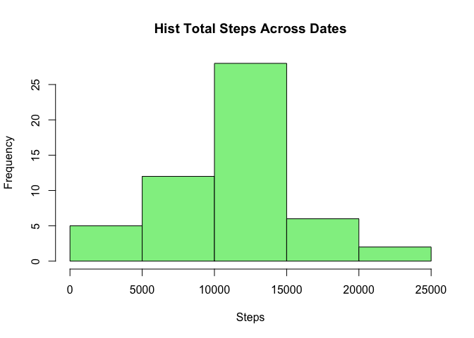
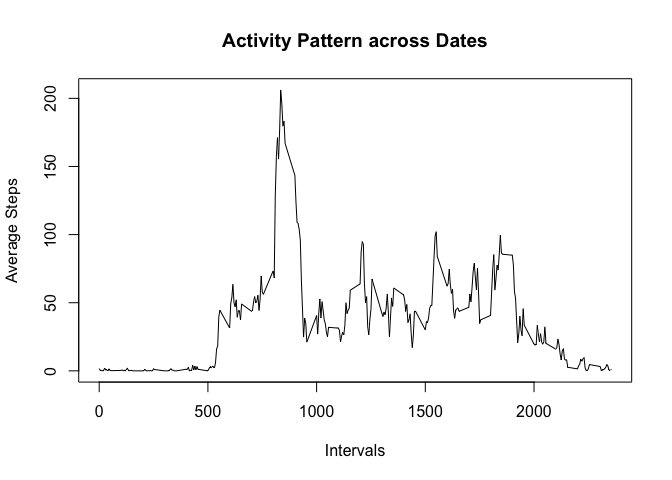
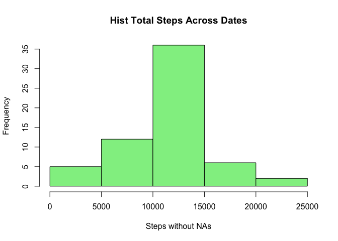
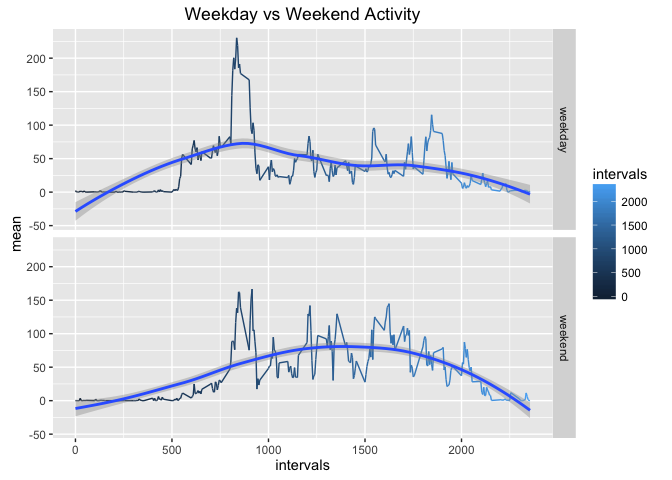

# Reproducible Research: Peer Assessment 1

---

## Loading and preprocessing the data

```r
# Get current working directory
myPath <- getwd()

# Create the full path for the csv file to be used
filePath <- paste(myPath, 'activity.csv', sep = '/')

# Download file in case it doesn't exist
if(!file.exists(filePath)){
  # From https://github.com/rdpeng/RepData_PeerAssessment1, Assigment section
  url <- 'https://d396qusza40orc.cloudfront.net/repdata%2Fdata%2Factivity.zip'
  
  # Destination for the zip to download
  zipPath <- 'activity.zip'
  # Start downloading, inform date and time
  print(paste('Download started at: ', Sys.time(), sep = ''))
  download.file(url, zipPath, mode = 'wb')
  
  # Unzip the file into a csv
  unzip(zipPath)
}

# Read csv file from local path and inform the date and time of access
rawData <- read.csv(filePath)
print(paste('Data file read at: ', Sys.time(), sep = ''))
```

```
## [1] "Data file read at: 2016-01-27 11:13:33"
```

```r
# Process the data into a format suitable, identify observations with step data
good <- !is.na(rawData$steps)

# Filter observations with step data (discard missing values)
procData <- rawData[good,]

# Discard the dates (factors) with no step data
procData$date <- factor(procData$date)
```
---

---

## What is mean total number of steps taken per day?

```r
# Only step and date columns are required
steps <- procData[,1:2]

# Order by date and steps for further median calculations
steps<-steps[order(steps$date, steps$steps, decreasing = FALSE),]

# Calculate the total number of steps taken per day
steps <- tapply(steps$steps, steps$date, sum)
# Storing the dates information
dates <- row.names(steps)

# Make a histogram of the total number of steps taken each day
# Creating a suitable data.frame for a plot
steps<-data.frame(dates, as.vector(steps))
names(steps) <- c('date', 'steps')
head(steps)
```

```
##         date steps
## 1 2012-10-02   126
## 2 2012-10-03 11352
## 3 2012-10-04 12116
## 4 2012-10-05 13294
## 5 2012-10-06 15420
## 6 2012-10-07 11015
```

```r
# Format date for X axis
steps$date = as.Date(steps[,'date'], format = '%Y-%m-%d')

# Plot
hist(steps$steps, xlab = 'Steps', main = 'Hist Total Steps Across Dates',
  col = c('lightgreen'))
```



```r
# Computation of means and medians per day
means <- tapply(procData$steps, procData$date, mean)
medians <- tapply(procData$steps, procData$date, median)
print(head(as.data.frame(means)))
```

```
##               means
## 2012-10-02  0.43750
## 2012-10-03 39.41667
## 2012-10-04 42.06944
## 2012-10-05 46.15972
## 2012-10-06 53.54167
## 2012-10-07 38.24653
```

```r
print(head(as.data.frame(medians)))
```

```
##            medians
## 2012-10-02       0
## 2012-10-03       0
## 2012-10-04       0
## 2012-10-05       0
## 2012-10-06       0
## 2012-10-07       0
```

```r
# Computation of total mean and median
mean = mean(steps$steps)
median = median(steps$steps)
print(as.data.frame(mean))
```

```
##       mean
## 1 10766.19
```

```r
print(as.data.frame(median))
```

```
##   median
## 1  10765
```
---

---

## What is the average daily activity pattern?

```r
# Install dplyr library if not available on the running environment, whichever
# the case the includes it in to the libraries pack
pkgReady <- function(pkgName) is.element(pkgName, installed.packages()[,1])
if(!pkgReady('dplyr')){install.packages('dplyr')}
library(dplyr)
```

```
## 
## Attaching package: 'dplyr'
```

```
## The following objects are masked from 'package:stats':
## 
##     filter, lag
```

```
## The following objects are masked from 'package:base':
## 
##     intersect, setdiff, setequal, union
```

```r
# Group data by intervals
aux <- group_by(procData, interval)

# Calculate average number of steps accross all days
aux <- summarise(aux, average = mean(steps))

# Plot, time series of interval and average number of steps, across all days
with(aux, plot(interval, average, type="l", xlab = 'Intervals',
  ylab = 'Average Steps', main = 'Activity Pattern across Dates'))
```



#### Max. number of steps (average) on a Interval

```r
# Interval across all days in the dataset with maximum number of steps -average
maxStepsAvg <- filter(aux, average == max(average))
print(maxStepsAvg)
```

```
## Source: local data frame [1 x 2]
## 
##   interval  average
##      (int)    (dbl)
## 1      835 206.1698
```
---

---

## Imputing missing values

#### Total number of missing values

```r
# Calculate and report the total number of missing values in the dataset
missNum = as.numeric(length(good[good == F]))
print(missNum)
```

```
## [1] 2304
```


```r
# Mean per interval strategy in order to fill the missing values in next steps
aux <- tapply(procData$steps, procData$interval, mean)

# Format the column types and names for better handling
aux <- data.frame(cbind(row.names(aux), as.numeric(aux)))
names(aux) <- c('interval', 'mean')

# Merge the raw data with the interval means to create a new dataset
newRaw <- merge (rawData, aux, by = c('interval', 'interval'), all.x = T)
newRaw <- newRaw[order(newRaw$date, newRaw$interval, decreasing = FALSE),]
newRaw$mean <- as.numeric(levels(newRaw$mean))[newRaw$mean]

# Create a new dataset that is equal to the original dataset but without NAs
# Store the total number of observations 
rQty = nrow(newRaw)
# Replace every empty step with the mean
for(i in 1:rQty){
  if(is.na(newRaw$steps[i])){
    newRaw$steps[i] = newRaw$mean[i]
  }
}

# New Raw Data, trim the mean column to fully match the original data
newRaw = newRaw[, c('steps', 'date','interval')]
head(newRaw)
```

```
##         steps       date interval
## 1   1.7169811 2012-10-01        0
## 63  0.3396226 2012-10-01        5
## 128 0.1320755 2012-10-01       10
## 205 0.1509434 2012-10-01       15
## 264 0.0754717 2012-10-01       20
## 327 2.0943396 2012-10-01       25
```

```r
# Calculate the total number of steps taken per day
dailySteps <- tapply(newRaw$steps, newRaw$date, sum)
# Storing the dates information
dates <- row.names(dailySteps)

# Make a histogram of the total number of steps taken each day
# Creating a suitable data.frame for a plot
dailySteps <- data.frame(dates, as.vector(dailySteps))
names(dailySteps) <- c('date', 'steps')

# Format date for X axis
dailySteps$date = as.Date(dailySteps[,'date'], format = '%Y-%m-%d')

# Plot
hist(dailySteps$steps, xlab = 'Steps without NAs',
  main = 'Hist Total Steps Across Dates', col = c('lightgreen'))
```



```r
# Computation of means and medians per day
means <- tapply(newRaw$steps, newRaw$date, mean)
medians <- tapply(newRaw$steps, newRaw$date, median)
print(head(as.data.frame(means)))
```

```
##               means
## 2012-10-01 37.38260
## 2012-10-02  0.43750
## 2012-10-03 39.41667
## 2012-10-04 42.06944
## 2012-10-05 46.15972
## 2012-10-06 53.54167
```

```r
print(head(as.data.frame(medians)))
```

```
##             medians
## 2012-10-01 34.11321
## 2012-10-02  0.00000
## 2012-10-03  0.00000
## 2012-10-04  0.00000
## 2012-10-05  0.00000
## 2012-10-06  0.00000
```

```r
# Computation of total mean and median
mean = mean(dailySteps$steps)
median = median(dailySteps$steps)
print(as.data.frame(mean))
```

```
##       mean
## 1 10766.19
```

```r
print(as.data.frame(median))
```

```
##     median
## 1 10766.19
```
#### - These values differ from the ones of the first part of the assignment
####   since filling the missing values with Mean Avgs caused an increment on
####   the frequencies.
#### - The Medians suffered alterations as well, since we had 0s passing the
####   middle, now we have some means instead.

---

---

## Are there differences in activity patterns between weekdays and weekends?

```r
#Create a factor with two levels -- "weekday" and "weekend"
wd <- weekdays(as.Date(newRaw$date, format = '%Y-%m-%d'), abbreviate = T)
wd <- data.frame(sapply (wd, function(x) {
  if(x %in% c('Mon', 'Tue', 'Wed', 'Thu', 'Fri')){
    x = 'weekday'
  }
  else
    x = 'weekend'
}))
names(wd) <- c('dayType')

# Merge the new raw data with the names of the days (weekday, weekend)
newRaw <- cbind(newRaw[,-2], wd[,1])
names(newRaw)[3] <- 'dayType'

# Separate dayTypes for means computations
weekdays <- newRaw[newRaw$dayType == 'weekday',]
weekends <- newRaw[newRaw$dayType == 'weekend',]

# Compute Means
weekdays <- tapply(weekdays$steps, weekdays$interval, mean)
weekends <- tapply(weekends$steps, weekends$interval, mean)

# Format computed data into a single data.frame
intervals <- as.integer(row.names(weekdays))
weekdays <- data.frame(intervals, weekdays, replicate(length(intervals), 'weekday'))
weekends <- data.frame(intervals, weekends, replicate(length(intervals), 'weekend'))
names(weekdays)[2:3] <- c('mean','dayType')
names(weekends)[2:3] <- c('mean','dayType')
aux <- rbind(weekdays, weekends)

# Install ggplot2 library if not available on the running environment, whichever
# the case the includes it in to the libraries pack
pkgReady <- function(pkgName) is.element(pkgName, installed.packages()[,1])
if(!pkgReady('ggplot2')){install.packages('ggplot2')}
library(ggplot2)

#Plot Time series of interval and the average number of steps, across all days
p = qplot(x=intervals, y=mean, data=aux, geom=c('path','smooth'), color=intervals,
  facets = dayType ~ ., main = 'Weekday vs Weekend Activity')
print(p)
```



#### We can observe enough differences on the average means per interval
#### between weekday and weekend activities
