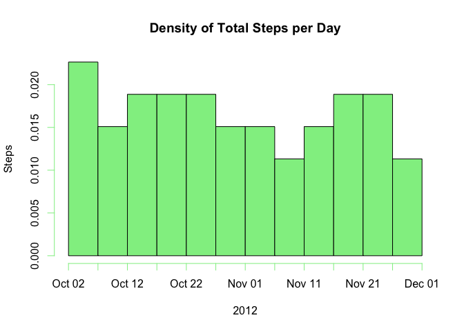
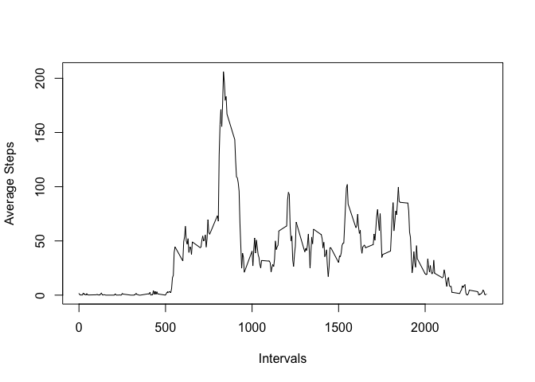
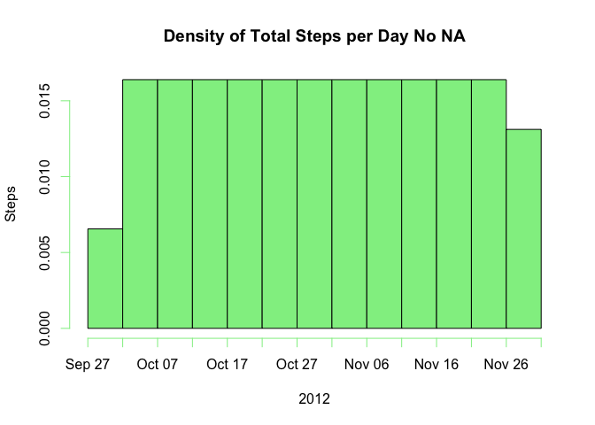
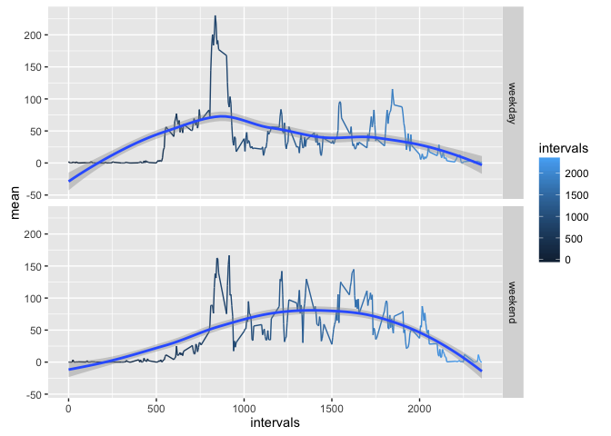

# Reproducible Research: Peer Assessment 1

## Loading and preprocessing the data

```r
# Get current working directory
myPath <- getwd()

# Create the full path for the csv file to be used
filePath <- paste(myPath, 'activity.csv', sep = '/')

# Download file in case it doesn't exist
if(!file.exists(filePath)){
  # From https://github.com/rdpeng/RepData_PeerAssessment1, Assigment section
  url <- 'https://d396qusza40orc.cloudfront.net/repdata%2Fdata%2Factivity.zip'
  
  # Destination for the zip to download
  zipPath <- 'activity.zip'
  # Start downloading, inform date and time
  print(paste('Download started at: ', Sys.time(), sep = ''))
  download.file(url, zipPath, mode = 'wb')
  
  # Unzip the file into a csv
  unzip(zipPath)
}

# Read csv file from local path and inform the date and time of access
rawData <- read.csv(filePath)
print(paste('Data file read at: ', Sys.time(), sep = ''))
```

```
## [1] "Data file read at: 2016-01-26 22:59:14"
```

```r
# Process the data into a format suitable, identify observations with step data
good <- !is.na(rawData$steps)

# Filter observations with step data (discard missing values)
procData <- rawData[good,]

# Discard the dates (factors) with no step data
procData$date <- factor(procData$date)
```

## What is mean total number of steps taken per day?

```r
# Only step and date columns are required
steps <- procData[,1:2]

# Order by date and steps for further median calculations
steps<-steps[order(steps$date, steps$steps, decreasing = FALSE),]

## Calculate the total number of steps taken per day
steps <- tapply(steps$steps, steps$date, sum)
# Storing the dates information
dates <- row.names(steps)

## Make a histogram of the total number of steps taken each day
# Creating a suitable data.frame for a plot
dailySteps<-data.frame(dates, as.vector(steps))
names(dailySteps) <- c('date', 'steps')

# Format date for X axis
dailySteps$date = as.Date(dailySteps[,'date'], format = '%Y-%m-%d')

# Plot
with(dailySteps, hist(x=date, main = 'Density of Total Steps per Day',
  col = c('lightgreen'), breaks = 10, ylab = 'Steps', xlab = '2012', freq = F),
  density=NULL)
```



```r
# Computation of means and medians per day
means <- tapply(procData$steps, procData$date, mean)
medians <- tapply(procData$steps, procData$date, median)

# Format objects for better visualization
print(as.data.frame(means))
```

```
##                 means
## 2012-10-02  0.4375000
## 2012-10-03 39.4166667
## 2012-10-04 42.0694444
## 2012-10-05 46.1597222
## 2012-10-06 53.5416667
## 2012-10-07 38.2465278
## 2012-10-09 44.4826389
## 2012-10-10 34.3750000
## 2012-10-11 35.7777778
## 2012-10-12 60.3541667
## 2012-10-13 43.1458333
## 2012-10-14 52.4236111
## 2012-10-15 35.2048611
## 2012-10-16 52.3750000
## 2012-10-17 46.7083333
## 2012-10-18 34.9166667
## 2012-10-19 41.0729167
## 2012-10-20 36.0937500
## 2012-10-21 30.6284722
## 2012-10-22 46.7361111
## 2012-10-23 30.9652778
## 2012-10-24 29.0104167
## 2012-10-25  8.6527778
## 2012-10-26 23.5347222
## 2012-10-27 35.1354167
## 2012-10-28 39.7847222
## 2012-10-29 17.4236111
## 2012-10-30 34.0937500
## 2012-10-31 53.5208333
## 2012-11-02 36.8055556
## 2012-11-03 36.7048611
## 2012-11-05 36.2465278
## 2012-11-06 28.9375000
## 2012-11-07 44.7326389
## 2012-11-08 11.1770833
## 2012-11-11 43.7777778
## 2012-11-12 37.3784722
## 2012-11-13 25.4722222
## 2012-11-15  0.1423611
## 2012-11-16 18.8923611
## 2012-11-17 49.7881944
## 2012-11-18 52.4652778
## 2012-11-19 30.6979167
## 2012-11-20 15.5277778
## 2012-11-21 44.3993056
## 2012-11-22 70.9270833
## 2012-11-23 73.5902778
## 2012-11-24 50.2708333
## 2012-11-25 41.0902778
## 2012-11-26 38.7569444
## 2012-11-27 47.3819444
## 2012-11-28 35.3576389
## 2012-11-29 24.4687500
```

```r
print(as.data.frame(medians))
```

```
##            medians
## 2012-10-02       0
## 2012-10-03       0
## 2012-10-04       0
## 2012-10-05       0
## 2012-10-06       0
## 2012-10-07       0
## 2012-10-09       0
## 2012-10-10       0
## 2012-10-11       0
## 2012-10-12       0
## 2012-10-13       0
## 2012-10-14       0
## 2012-10-15       0
## 2012-10-16       0
## 2012-10-17       0
## 2012-10-18       0
## 2012-10-19       0
## 2012-10-20       0
## 2012-10-21       0
## 2012-10-22       0
## 2012-10-23       0
## 2012-10-24       0
## 2012-10-25       0
## 2012-10-26       0
## 2012-10-27       0
## 2012-10-28       0
## 2012-10-29       0
## 2012-10-30       0
## 2012-10-31       0
## 2012-11-02       0
## 2012-11-03       0
## 2012-11-05       0
## 2012-11-06       0
## 2012-11-07       0
## 2012-11-08       0
## 2012-11-11       0
## 2012-11-12       0
## 2012-11-13       0
## 2012-11-15       0
## 2012-11-16       0
## 2012-11-17       0
## 2012-11-18       0
## 2012-11-19       0
## 2012-11-20       0
## 2012-11-21       0
## 2012-11-22       0
## 2012-11-23       0
## 2012-11-24       0
## 2012-11-25       0
## 2012-11-26       0
## 2012-11-27       0
## 2012-11-28       0
## 2012-11-29       0
```

## What is the average daily activity pattern?

```r
# This function installs the dplyr library if not available on the running
# environment, whichever the case the includes it in to the libraries pack
pkgReady <- function(pkgName) is.element(pkgName, installed.packages()[,1])
if(!pkgReady('dplyr')){install.packages('dplyr')}
library(dplyr)
```

```
## 
## Attaching package: 'dplyr'
```

```
## The following objects are masked from 'package:stats':
## 
##     filter, lag
```

```
## The following objects are masked from 'package:base':
## 
##     intersect, setdiff, setequal, union
```

```r
# Group data by intervals
aux <- group_by(procData, interval)

# Calculate average number of steps accross all days
aux <- summarise(aux, average = mean(steps))

# Plot, time series of interval and average number of steps, across all days
with(aux, plot(interval, average, type="l", xlab = 'Intervals',
  ylab = 'Average Steps'))
```



```r
# Interval across all days in the dataset with maximum number of steps -average
maxStepsAvg <- filter(aux, average == max(average))
print('Max. number of steps (average) per day and its interval:')
```

```
## [1] "Max. number of steps (average) per day and its interval:"
```

```r
print(maxStepsAvg)
```

```
## Source: local data frame [1 x 2]
## 
##   interval  average
##      (int)    (dbl)
## 1      835 206.1698
```


## Imputing missing values

```r
# Calculate and report the total number of missing values in the dataset
missNum = as.numeric(length(good[good == F]))
print(paste('Total number of missing values:', missNum, sep = ' '))
```

```
## [1] "Total number of missing values: 2304"
```

```r
# Fill in all of the missing values with the mean for that 5-minute interval
aux <- tapply(procData$steps, procData$interval, mean)

# Format the column types and names for better handling
aux <- data.frame(cbind(row.names(aux), as.numeric(aux)))
names(aux) <- c('interval', 'mean')

# Merge the raw data with the interval means to create a new dataset
newRaw <- merge (rawData, aux, by = c('interval', 'interval'), all.x = T)
newRaw <- newRaw[order(newRaw$date, newRaw$interval, decreasing = FALSE),]
newRaw$mean <- as.numeric(levels(newRaw$mean))[newRaw$mean]

# Create a new dataset that is equal to the original dataset but without NAs
# Store the total number of observations 
rQty = nrow(newRaw)
# Replace every empty step with the mean
for(i in 1:rQty){
  if(is.na(newRaw$steps[i])){
    newRaw$steps[i] = newRaw$mean[i]
  }
}

# New Raw Data, trim the mean column to fully match the original data
newRaw = newRaw[, c('steps', 'date','interval')]

# Calculate the total number of steps taken per day
dailySteps <- tapply(newRaw$steps, newRaw$date, sum)
# Storing the dates information
dates <- row.names(dailySteps)

# Make a histogram of the total number of steps taken each day
# Creating a suitable data.frame for a plot
dailySteps <- data.frame(dates, as.vector(dailySteps))
names(dailySteps) <- c('date', 'steps')

# Format date for X axis
dailySteps$date = as.Date(dailySteps[,'date'], format = '%Y-%m-%d')

# Plot
with(dailySteps, hist(x=date, main = 'Density of Total Steps per Day No NA',
  col = c('lightgreen'), breaks = 10, ylab = 'Steps', xlab = '2012', freq = F),
  density=NULL)
```



```r
# Computation of means and medians per day
means <- tapply(newRaw$steps, newRaw$date, mean)
medians <- tapply(newRaw$steps, newRaw$date, median)

# Format objects for better visualization
print(as.data.frame(means))
```

```
##                 means
## 2012-10-01 37.3825996
## 2012-10-02  0.4375000
## 2012-10-03 39.4166667
## 2012-10-04 42.0694444
## 2012-10-05 46.1597222
## 2012-10-06 53.5416667
## 2012-10-07 38.2465278
## 2012-10-08 37.3825996
## 2012-10-09 44.4826389
## 2012-10-10 34.3750000
## 2012-10-11 35.7777778
## 2012-10-12 60.3541667
## 2012-10-13 43.1458333
## 2012-10-14 52.4236111
## 2012-10-15 35.2048611
## 2012-10-16 52.3750000
## 2012-10-17 46.7083333
## 2012-10-18 34.9166667
## 2012-10-19 41.0729167
## 2012-10-20 36.0937500
## 2012-10-21 30.6284722
## 2012-10-22 46.7361111
## 2012-10-23 30.9652778
## 2012-10-24 29.0104167
## 2012-10-25  8.6527778
## 2012-10-26 23.5347222
## 2012-10-27 35.1354167
## 2012-10-28 39.7847222
## 2012-10-29 17.4236111
## 2012-10-30 34.0937500
## 2012-10-31 53.5208333
## 2012-11-01 37.3825996
## 2012-11-02 36.8055556
## 2012-11-03 36.7048611
## 2012-11-04 37.3825996
## 2012-11-05 36.2465278
## 2012-11-06 28.9375000
## 2012-11-07 44.7326389
## 2012-11-08 11.1770833
## 2012-11-09 37.3825996
## 2012-11-10 37.3825996
## 2012-11-11 43.7777778
## 2012-11-12 37.3784722
## 2012-11-13 25.4722222
## 2012-11-14 37.3825996
## 2012-11-15  0.1423611
## 2012-11-16 18.8923611
## 2012-11-17 49.7881944
## 2012-11-18 52.4652778
## 2012-11-19 30.6979167
## 2012-11-20 15.5277778
## 2012-11-21 44.3993056
## 2012-11-22 70.9270833
## 2012-11-23 73.5902778
## 2012-11-24 50.2708333
## 2012-11-25 41.0902778
## 2012-11-26 38.7569444
## 2012-11-27 47.3819444
## 2012-11-28 35.3576389
## 2012-11-29 24.4687500
## 2012-11-30 37.3825996
```

```r
print(as.data.frame(medians))
```

```
##             medians
## 2012-10-01 34.11321
## 2012-10-02  0.00000
## 2012-10-03  0.00000
## 2012-10-04  0.00000
## 2012-10-05  0.00000
## 2012-10-06  0.00000
## 2012-10-07  0.00000
## 2012-10-08 34.11321
## 2012-10-09  0.00000
## 2012-10-10  0.00000
## 2012-10-11  0.00000
## 2012-10-12  0.00000
## 2012-10-13  0.00000
## 2012-10-14  0.00000
## 2012-10-15  0.00000
## 2012-10-16  0.00000
## 2012-10-17  0.00000
## 2012-10-18  0.00000
## 2012-10-19  0.00000
## 2012-10-20  0.00000
## 2012-10-21  0.00000
## 2012-10-22  0.00000
## 2012-10-23  0.00000
## 2012-10-24  0.00000
## 2012-10-25  0.00000
## 2012-10-26  0.00000
## 2012-10-27  0.00000
## 2012-10-28  0.00000
## 2012-10-29  0.00000
## 2012-10-30  0.00000
## 2012-10-31  0.00000
## 2012-11-01 34.11321
## 2012-11-02  0.00000
## 2012-11-03  0.00000
## 2012-11-04 34.11321
## 2012-11-05  0.00000
## 2012-11-06  0.00000
## 2012-11-07  0.00000
## 2012-11-08  0.00000
## 2012-11-09 34.11321
## 2012-11-10 34.11321
## 2012-11-11  0.00000
## 2012-11-12  0.00000
## 2012-11-13  0.00000
## 2012-11-14 34.11321
## 2012-11-15  0.00000
## 2012-11-16  0.00000
## 2012-11-17  0.00000
## 2012-11-18  0.00000
## 2012-11-19  0.00000
## 2012-11-20  0.00000
## 2012-11-21  0.00000
## 2012-11-22  0.00000
## 2012-11-23  0.00000
## 2012-11-24  0.00000
## 2012-11-25  0.00000
## 2012-11-26  0.00000
## 2012-11-27  0.00000
## 2012-11-28  0.00000
## 2012-11-29  0.00000
## 2012-11-30 34.11321
```

```r
print('These values differ from the ones of the first part of the assignment.')
```

```
## [1] "These values differ from the ones of the first part of the assignment."
```

```r
print('By filling the NAs the total steps per day increased for some days')
```

```
## [1] "By filling the NAs the total steps per day increased for some days"
```

```r
print('The Medians suffered alterations as well, since we had 0s passing the')
```

```
## [1] "The Medians suffered alterations as well, since we had 0s passing the"
```

```r
print('middle, now we have some means instead.')
```

```
## [1] "middle, now we have some means instead."
```


## Are there differences in activity patterns between weekdays and weekends?

```r
#Create a factor with two levels -- "weekday" and "weekend"
wd <- weekdays(as.Date(newRaw$date, format = '%Y-%m-%d'), abbreviate = T)
wd <- data.frame(sapply (wd, function(x) {
  if(x %in% c('Mon', 'Tue', 'Wed', 'Thu', 'Fri')){
    x = 'weekday'
  }
  else
    x = 'weekend'
}))
names(wd) <- c('dayType')

# Merge the new raw data with the names of the days (weekday, weekend)
newRaw <- cbind(newRaw[,-2], wd[,1])
names(newRaw)[3] <- 'dayType'

# Separate dayTypes for means computations
weekdays <- newRaw[newRaw$dayType == 'weekday',]
weekends <- newRaw[newRaw$dayType == 'weekend',]

# Compute Means
weekdays <- tapply(weekdays$steps, weekdays$interval, mean)
weekends <- tapply(weekends$steps, weekends$interval, mean)

# Format computed data into a single data.frame
intervals <- as.integer(row.names(weekdays))
weekdays <- data.frame(intervals, weekdays, replicate(length(intervals), 'weekday'))
weekends <- data.frame(intervals, weekends, replicate(length(intervals), 'weekend'))
names(weekdays)[2:3] <- c('mean','dayType')
names(weekends)[2:3] <- c('mean','dayType')
aux <- rbind(weekdays, weekends)

# This function installs the ggplot2 library if not available on the running
# environment, whichever the case the includes it in to the libraries pack
pkgReady <- function(pkgName) is.element(pkgName, installed.packages()[,1])
if(!pkgReady('ggplot2')){install.packages('ggplot2')}
library(ggplot2)

#Plot Time series of interval and the average number of steps, across all days
qplot(x=intervals, y=mean, data=aux, geom=c('path','smooth'), color=intervals,
  facets = dayType ~ .)
```


